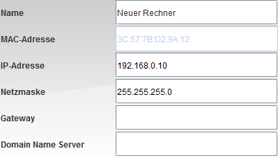
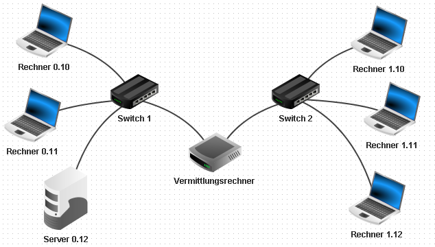

# Skriptum zur Unterrichtsreihe „Netzwerke mit FILIUS“
> * © 2015-2023, Daniel Garmann ```<dgarmann@freenet.de>```,
>   [Gymnasium Odenthal](http://www.gymnasium-odenthal.de),
>   Lizenz: [CC-BY-SA](https://creativecommons.org/licenses/by-sa/4.0/)
> * © 2023, Andreas B. Mundt ```<andi@debian.org>```, Überarbeitung mit
>   kleineren Änderungen, Markdown

[^1]

[^1]: Alle Bilder wurden dem Programm FILIUS entnommen. Die Rechte
    liegen bei den Entwicklern.

<!-- Inhaltsverzeichnis autogeneriert und anschließend geringfügig
    angepasst -->
<!-- markdown-toc start - Don't edit this section. Run M-x markdown-toc-refresh-toc -->
**Inhaltsverzeichnis**

- [Skriptum zur Unterrichtsreihe „Netzwerke mit FILIUS“](#skriptum-zur-unterrichtsreihe-netzwerke-mit-filius)
    - [Vorbemerkungen](#vorbemerkungen)
    - [Aufbau von FILIUS](#aufbau-von-filius)
    - [Der Entwurfsmodus](#der-entwurfsmodus)
        - [Netzwerkkomponenten](#netzwerkkomponenten)
            - [Rechner und Notebook](#rechner-und-notebook)
            - [Kabel](#kabel)
            - [Switch](#switch)
            - [Router](#router)
            - [Modem](#modem)
    - [Der Simulationsmodus](#der-simulationsmodus)
        - [Netzwerkanwendungen](#netzwerkanwendungen)
            - [Systemanwendungen](#systemanwendungen)
            - [Client-Anwendungen](#client-anwendungen)
            - [Server-Anwendungen](#server-anwendungen)
    - [Der Dokumentationsmodus](#der-dokumentationsmodus)
        - [Dokumentationsmöglichkeiten](#dokumentationsmöglichkeiten)
    - [Aufgaben: Aufbau und Simulation von Netzwerken](#aufgaben-aufbau-und-simulation-von-netzwerken)
        - [Direkte Vernetzung](#direkte-vernetzung)
        - [Vernetzung über einen Switch](#vernetzung-über-einen-switch)
        - [Verbinden von Netzwerken über einen Router](#verbinden-von-netzwerken-über-einen-router)
        - [Simulation des World Wide Web](#simulation-des-world-wide-web)
        - [eMailverkehr im Netzwerk](#emailverkehr-im-netzwerk)
    - [Ausblick](#ausblick)
        - [Virtuelle und reale Netzwerke](#virtuelle-und-reale-netzwerke)
        - [_Peer-To-Peer_ Dateiaustausch](#_peer-to-peer_-dateiaustausch)
        - [DHCP-Server einrichten](#dhcp-server-einrichten)
        - [Eigene Software erstellen und einbinden](#eigene-software-erstellen-und-einbinden)
        - [Routing über mehrere Netze (statisches Routing)](#routing-über-mehrere-netze-statisches-routing)
- [Anhang A: IPv4-Adressen](#anhang-a-ipv4-adressen)
- [Fußnoten](#footnotes)

<!-- markdown-toc end -->


## Vorbemerkungen
FILIUS[^2] wurde initial an der Universität Siegen entwickelt, um
Unterricht zu Netzwerken und dem Internet zu unterstützen. Zielgruppe
sind Lernende in der Sekundarstufe allgemein bildender Schulen. Mit
FILIUS werden Lernaktivitäten ermöglicht, die insbesondere
entdeckendes Lernen unterstützen sollen. Die Entwickler von FILIUS
geben an:

[^2]: FILIUS bedeutet Freie Interaktive Lernumgebung für
Internetworking der Universität Siegen.

> FILIUS ist eine explorative Lernsoftware zum Thema
> Internetworking. Sie dient dem Erlernen von Grundwissen zum Internets
> und steht jedem frei zur Verfügung, der sich mit dem Thema Internet
> näher befassen möchte, ist aber insbesondere für den Einsatz in
> Schulen gedacht. Die Absicht der Entwickler dieser Software ist es,
> möglichst viele Nutzer zu gewinnen. Die Etablierung nicht nur an
> Schulen in Nordrhein-Westfalen, sondern in ganz Deutschland wäre der
> denkbar größte Erfolg und Lohn für die Mühen, die das Entwickler-Team
> auf sich genommen hat. Kurz gesagt: Jeder ist herzlich eingeladen die
> Software herunter zu laden.[^3]

[^3]:
http://fameibl.de/content/projects/filius/download/Dokumentation2.pdf,
Seite 2

Mit diesem Skript soll Ihnen als Lehrende/r eine Möglichkeit
aufgezeigt werden, wie Sie das Programm im Unterricht einsetzen
können. Die Erläuterungen werden stets durch Aufgaben ergänzt, deren
jeweilige Musterlösung als Download verfügbar ist.

## Aufbau von FILIUS
Nach dem ersten Start des Programms erhalten Sie die Möglichkeit, die
Sprache einzustellen, welche dann dauerhaft[^4] gespeichert bleibt.
Ab nun zeigt sich das Programm nach dem Start mit folgender
Oberfläche:

[^4]: Diese Einstellung wird im Benutzerverzeichnis im Ordner
```.filius``` gespeichert, der zum Zurücksetzen gelöscht werden kann.

{width=100%}

Das Programm unterscheidet zwischen drei verschiedenen Arbeitsmodi,
dem Entwurfsmodus, dem Simulationsmodus und dem Dokumentationsmodus:


In den Entwurfsmodus wechseln Sie, indem Sie auf den Hammer
{width=20px} in der oberen
Symbolleiste klicken. Dieser Modus ermöglicht Ihnen den Aufbau oder
die Veränderung eines Netzwerkes. FILIUS befindet sich nach dem
Programmstart stets in diesem Modus.


In den Simulationsmodus gelangen Sie, indem Sie auf den grünen Pfeil
{width=20px}
klicken.  Dieser Modus erlaubt es Ihnen, das aufgebaute Netzwerk zu
simulieren, unterschiedliche Netzwerkanwendungen auf den Rechnern zu
installieren und auszuführen.


Den Dokumentationsmodus erreichen Sie, indem Sie auf den Bleistift
{width=20px}
klicken. Dieser Modus ermöglicht es, das Netzwerk durch Annotationen
zu ergänzen und symbolische Gruppierungen im Netzwerk vorzunehmen.

Bevor Sie nun konkrete Netzwerke aufbauen, werden hier zunächst
allgemein die Bedienungsmodi und wesentlichen Komponenten von FILIUS
und den simulierten Netzwerken vorgestellt.

## Der Entwurfsmodus
In diesem Kapitel wird die Funktionsweise der in FILIUS verwendeten
Komponenten allgemein erläutert.  Im Anschluss daran werden Sie diese
Komponenten nutzen, um schrittweise komplexer werdende Netzwerke
aufzubauen und zu simulieren.

### Netzwerkkomponenten
FILIUS bietet auf der linken Symbolleiste einen Katalog von
Komponenten an, welche im Arbeitsbereich beliebig positioniert,
vernetzt, verändert und auch wieder entfernt werden können.  Alle
Komponenten werden mit der linken Maustaste per Drag & Drop in den
weißen Arbeitsbereich gezogen, Kabel werden mit jeweils einem Klick
auf die zu vernetzenden Komponenten gelegt. Die Kabelverbindungen
aktualisieren sich selbständig, wenn eine Komponente neu positioniert
wird. Mithilfe der rechten Maustaste können Sowohl Kabel als auch
Komponenten wieder entfernt werden. Im Folgenden soll nun zunächst die
Funktion der einzelnen Komponenten allgemein erläutert werden. Eine
Konkretisierung erfolgt dann im Kapitel zum Aufbau und Test von
Netzwerken.

#### Rechner und Notebook
FILIUS bietet zwei verschiedene Arten von Computern an, die im
virtuellen Netzwerk verbunden werden können.  Beide Computerarten sind
bezüglich ihrer Funktionalität identisch, allerdings bietet es sich
an, eine logische Unterscheidung vorzunehmen.


Wählen Sie für Computer, welche die Funktion eines Clients übernehmen,
stets ein Notebook {width=20}, und für
Computer, die die Funktion eines Servers ausüben, stets den Rechner
{width=20}.


Beide Computerarten werden mit der linken Maustaste auf den
Arbeitsbereich gezogen. Die Netzwerk-Konfiguration eines Computers
erhalten Sie mit Doppelklick auf das Computersymbol. In dem folgenden
Fenster können Sie nun Einstellungen bezüglich des Rechnernamens,
seiner IP-Adresse und seiner Subnetzmaske vornehmen. Die
Standardkonfiguration eines Rechners sieht dabei wie folgt aus:



Wenn Ihnen bzw. Ihren Schülern der Aufbau einer IP-Adresse nicht
geläufig ist, so lesen Sie bitte zunächst das Kapitel A zu IP-Adressen
im Anhang.

#### Kabel
Computer können mithilfe von Kabeln {width=20}
verbunden werden.  Nachdem Sie das Kabel gewählt haben, können Sie nun
nacheinander zwei andere Komponenten auf dem Arbeitsbereich anklicken,
welche daraufhin mit einem Kabel verbunden werden.

#### Switch
Sobald mehr als zwei Computer miteinander verbunden werden sollen,
benötigen Sie einen zentralen Knotenpunkt. Die einfachste Art des
Knotenpunkts bietet Ihnen FILIUS mit dem Switch
{width=20}. Auch für dieses Komponente können
Sie die Einstellungen mithilfe eines Doppelklicks anzeigen und
ändern.  Ein Switch "merkt" sich nach der ersten Netzwerkanfrage die
an ihm angeschlossenen Computer und leitet Netzwerksignale
entsprechend weiter. Ein Switch verbindet üblicherweise allerdings nur
Computer eines einzelnen Netzwerksegments.

#### Router
Die Funktionalität des Routers (auch: Vermittlungsrechners) besteht
darin, anhand einer Weiterleitungstabelle IP-Pakete über
Netzwerkgrenzen hinweg zu vermitteln, d.h. weiterzuleiten.

Möchten Sie IP-Pakete aus einem Netzwerk in ein anderes Netzwerk
versenden, so benötigen Sie zur Verbindung der Netzwerke einen
Router {width=20}. Damit dieser seine Arbeit
richtig durchführen kann, müssen alle an ihn angeschlossenen
Komponenten in unterschiedlichen Netzwerksegmenten liegen. Dies gilt
auch für einzelne Rechner, die evtl. an ihn angeschlossen werden.

Zu Anfang fragt FILIUS, wie viele Schnittstellen der Router
bereitstellen soll.  Die hier eingestellte Anzahl kann später in den
Einstellungen des Vermittlungsrechners (Doppelklick auf den Router)
unter der Registerkarte ```"Allgemein"``` korrigiert werden.


In den Einstellungen finden Sie auch zu jeder Schnittstelle eine
Registerkarte für die Einstellung der Netzwerkkarte des daran
befindlichen Netzwerks.  Tragen Sie hier die IP-Adresse ein, an die
Netzwerksignale gesendet werden sollen (in der Regel die erste oder
letzte verfügbare Adresse des Netzwerks). Ebenso muss dann an allen im
Netzwerk befindlichen Computern ein Gateway eingetragen werden. Die
genauen Einstellungen werden später bei einer entsprechenden
Aufgabenstellung konkretisiert.

#### Modem
FILIUS bietet Ihnen die Möglichkeit, über ein real existierendes
Netzwerk mehrere FILIUS-Programme miteinander zu vernetzen und damit
Netzwerksignale im real existierenden Netzwerk zu versenden[^6]. Dafür
müssen alle beteiligten FILIUS-Instanzen ein Modem
{width=20} im jeweils eigenen virtuellen Netzwerk
einbinden. In einem der beteiligten virtuellen Netzwerke muss in den
Einstellungen das Modem als Empfänger eingestellt werden, indem das
Häkchen vor ```"Auf eingehende Verbindungsanfrage warten"``` gesetzt
wird und über den Button ```"Aktivieren"``` die Annahme der
Verbindungen bestätigt wird.

[^6]: Voraussetzung zur Nutzung dieser Funktionalität ist, dass
entsprechende Verbindungen nicht durch lokale Firewalls unterbunden
werden.


Alle Modems der anderen beteiligten virtuellen Netzwerke können nun
über die real existierende Netzwerk IP-Adresse des Empfänger-Modems
eine reale Netzwerkverbindung aufbauen. Alle verbunden Modems zeigen
den erfolgreichen Verbindungsaufbau durch einen kleinen grünen Punkt
an.

## Der Simulationsmodus
FILIUS erlaubt es Ihnen im Simulationsmodus, Software auf den
einzelnen Computern zu installieren, zu deinstallieren und sie
auszuführen. Bitte wechseln Sie dafür in diesen Modus, indem Sie auf
den grünen Pfeil {width=20} klicken.

Die Software ist vorwiegend dazu gedacht, Netzwerkaktivitäten auf
unterschiedlichen Ebenen des Schichtenmodells sichtbar zu machen.
Die Veranschaulichung der Netzwerkaktivität kann mithilfe des Reglers
{width=80} in der Geschwindigkeit variiert
werden. Dazu gehört zum einen die Darstellung der Netzwerksignale an
den Leitungen als auch die Darstellung der Signale im Schichtenmodell,
welches man für jeden Rechner mithilfe der rechten Maustaste aufrufen
kann.


Doch bevor Sie eine Netzwerkaktivität beobachten können, ist es
notwendig, Software zu installieren. Mithilfe eines Doppelklicks auf
einen Computer oder über dessen Kontextmenü gelangen Sie auf den
Desktop des jeweiligen Computers:


Über das Symbol zur Software-Installation {width=20}
können Sie nun beliebige Software installieren
{width=20} oder deinstallieren
{width=20}. Im Folgenden sollen auch hier
zunächst die Funktion der einzelnen Netzwerkanwendungen allgemein
erläutert werden. Eine Konkretisierung erfolgt dann im Kapitel zum
Aufbau und der Simulation von Netzwerken.

### Netzwerkanwendungen
FILIUS unterscheiden drei Arten von Anwendungen: Client-Anwendungen,
Server-Anwendungen und System-Anwendungen. Diese werden nun den
jeweiligen Gruppen entsprechend kurz vorgestellt.

#### Systemanwendungen


Diese Anwendung ermöglicht es Ihnen, real existierende Dateien von
Ihrer Festplatte auf den virtuellen Computer zu übertragen.


Über diese Anwendung haben Sie die Möglichkeit, Systembefehle über
eine Kommandozeilen abzusetzen. Eine Liste der verfügbaren Befehle
wird Ihnen nach dem Start des Terminals angezeigt.


Mit Ihm können Sie einfache Textdateien z.B. ```HTML```-Dateien
erstellen und bearbeiten.  Natürlich können Sie auch zuvor mit dem
Datei-Explorer importierte Dateien verändern.


Hier können Sie Ihre Firewall einrichten, indem Sie bestimmte Ports
netzwerkintern oder netzwerkübergreifend sperren oder öffnen.


Dieses Programm erlaubt es Ihnen, ein Bild zu öffnen und zu betrachten.

#### Client-Anwendungen


Diese Anwendung ermöglicht es Ihnen, Emails virtuell zu versenden und
zu empfangen.


Mit ihm können Sie Webseiten betrachten. Der Browser kann mit den
wichtigsten html-Befehlen umgehen.


Der Client dient dazu, mit einem Server in Kontakt zu treten. Diese
Software ermöglicht einen einfachen Test, ob das Netzwerk
funktioniert.


Mithilfe dieser ```Peer-To-Peer``-Anwendung können Sie Dateien in
einem virtuellen Netzwerk teilen.

#### Server-Anwendungen


Mit ihm können Sie die Auflösung symbolischen Rechnernamen in
zugehörige IP-Adressen simulieren.


Diese Anwendung erlaubt es Ihnen, mehrere eMail-Konten einzurichten,
welche dann mit den eMail-Programmen genutzt werden können


Hiermit machen Sie einen Computer zu einem Webserver, sodass andere
Rechner mithilfe des Webbrowsers auf die Seiteninhalte dieses
Computers zugreifen können.  Eine voreingestellte ```index.html```
finden Sie im virtuellen Verzeichnis ```root/webserver```.


Einmal gestartet spiegelt der ```Echo-Server``` alle eingehenden
Nachrichten an den jeweiligen Client zurück.

## Der Dokumentationsmodus
FILIUS ermöglicht es, Netzwerkstrukturen zu dokumentieren und
symbolisch zu gruppieren. Bitte wechseln Sie dafür in diesen Modus,
indem Sie auf den Bleistift klicken {width=20}.

### Dokumentationsmöglichkeiten
FILIUS bietet in diesem Modus zwei verschiedene Möglichkeiten, das
virtuelle Netzwerk zu dokumentieren, welche hier kurz vorgestellt
werden sollen. Im weiteren Verlauf dieses Skripts wird nicht weiter
auf Dokumentationsmöglichkeiten eingegangen, dem Leser steht es aber
selbstverständlich frei, eigene virtuelle Netzwerke sinnvoll zu
dokumentieren.


Mithilfe von Textfeldern können ergänzende Informationen in das
virtuelle Netzwerk eingefügt werden. Die Textfelder haben keinen
Einfluss auf die Eigenschaften des Netzwerks im Entwurfsmodus oder auf
die Netzwerkaktivitäten im Simulationsmodus.


Das Gleiche gilt für die Gliederungsflächen. Sie dienen dazu, einzelne
Teile des virtuellen Netzwerks symbolisch zu gruppieren. Die Flächen
können an den Rändern auf die passende Größe gezogen werden und werden
nach Verlassen des Dokumentationsmodus hinter die Komponenten gelegt.


Mit der Schaltfläche Exportieren wird das virtuelle Netzwerk als
Portable Network Graphic (PNG-Datei) gespeichert.

## Aufgaben: Aufbau und Simulation von Netzwerken
Im Folgenden sollen nun Netzwerke mit wachsender Komplexität aufgebaut
und getestet werden. Eine Verzahnung von Entwurfs- und
Simulationsmodus ist dabei unumgänglich. Anhand des Symbols bei der
Aufgabenstellung erkennen Sie, ob die jeweilige Aufgabe im Entwurfs-
{width=20} oder im Simulationsmodus
{width=20} durchzuführen ist.

### Direkte Vernetzung
Die einfachste Art Daten zwischen zwei Rechnern auszutauschen besteht
darin, die Rechner direkt mit einem Netzwerkkabel zu verbinden. Man
spricht hier von einer Point-To-Point-Verbindung. In der Praxis können
so zwei Rechner direkt mit einem sogenannten _crossover_-Kabel
verbunden werden.

> #### Aufgabe 1
> {width=20} Erstellen Sie ein Netzwerk mit zwei
> verbundenen Computern.
>
> 
>
> Die Computer sollen die abgebildeten Namen sowie die IP-Adressen
> ```192.168.0.10/24``` und ```192.168.0.11/24``` besitzen. Durch die
> Subnetzmaske ```/24``` bzw. ```255.255.255.0``` stellen Sie sicher,
> dass beide Computer im selben Netzwerk liegen.
>
> > Hinweis: Wenn Sie die Namen nicht manuell eingeben wollen, so
> > können Sie durch ein Häkchen vor ```"IP-Adresse als Name
> > verwenden"``` den Namen automatisch setzen lassen.
>
> #### Aufgabe 2a
> {width=20} Installieren Sie auf dem Rechner
> ```0.10``` eine Befehlszeile. Starten Sie die Befehlszeile und testen
> Sie die Verbindung zum Rechner ```0.11``` mit dem Befehl ```ping
> 192.168.0.11```. Beobachten Sie die Netzwerkaktivität, indem Sie sich
> den Datenaustausch von Rechner ```0.10``` anzeigen lassen.
>
> 
>
> An dem Fenster erkennt man, dass der Computer viermal ein ICMP-Paket
> an den anderen Computer schickt (```ping```). Der Computer wartet
> nun jedes Mal ab, ob eine Antwort (```pong```) von dem anderen
> Computer zurück kommt. Diesen Datenaustausch kann man auch in dem
> Datenaustausch-Fenster erkennen, wobei die ersten beiden Zeilen des
> Datenaustauschs zum Adress Resolution Protocol gehören, welches die
> physikalische Adresse des Rechners ermittelt. Die nächsten acht
> Zeilen stehen jeweils paarweise für einen ```ping```-```pong```
> Austausch und gehören zum Internet Control Message Protocol (ICMP),
> welches Bestandteil des Internetprotokolls IPv4 ist:
>
> 
>
> Man erkennt auch, dass die Netzwerkaktivität maximal auf der
> Vermittlungsschicht abläuft. Höher liegende Schichten werden für
> diesen Verbindungstest noch nicht benötigt. Durch Klick auf eine
> einzelne Zeile des Datenaustauschs werden Informationen der darunter
> liegenden Schichten sowie konkrete Informationen zu den einzelnen
> verwendeten Schichten angezeigt.
>
> #### Aufgabe 2b
> {width=20} Testen Sie auch andere Befehle auf der
> Befehlszeile, wie z.B. die Befehle ```ipconfig```, oder ```host
> localhost``` oder ```dir```. Der Sinn des ```host```-Befehls wird zu
> einem späteren Zeitpunkt im Zusammenhang mit einem DNS-Server
> evtl. deutlicher.

### Vernetzung über einen Switch
Sobald Sie in einem Netzwerk mehr als zwei Rechner verbinden wollen,
benötigen Sie einen Switch, an den Sie beliebig viele Rechner
anschließen können. Der Switch merkt sich im Simulationsmodus alle
MAC-Adressen der an ihn angeschlossenen Netzwerkschnittstellen, soass er
nach der ersten Netzwerkaktivität stets die Datenpakete an den
zugehörigen Port (Anschlussbuchse) weiterleiten kann. Dieses
Komponente nutzen wir nun, um drei Rechner miteinander zu verbinden.

> #### Aufgabe 3
> {width=20} Erweitern Sie nun das Netzwerk um einen
> dritten Computer, einen Server, mit dem abgebildeten Namen und der
> IP-Adresse ```192.168.0.12/24```, welcher damit im gleichen Netzwerk
> liegt. Achten Sie darauf, dass Sie von nun an für Computer mit der
> Funktion eines Servers das Rechner-Symbol
> {width=20} wählen. Verbinden Sie alle Computer
> mit einem Switch wie abgebildet:
>
> 
>
> #### Aufgabe 4
> {width=20} Installieren Sie auf dem Server
> ```0.12``` einen ```Echo-Server``` und starten diesen auf dem
> voreingestellten Port ```55555```. Installieren Sie auf einem Client
> einen ```Einfachen Client``` und verbinden Sie diesen mit dem
> Server. Senden Sie vom Client einige Textnachrichten und beobachten
> Sie den Effekt. Schauen Sie sich auch die Netzwerkaktivität im
> Datenaustausch-Fenster des Clients an.
>
> {width=49%}
> {width=49%}
>
> {width=62%}
> {width=37%}
>
> Sie können am Datenaustausch beobachten, dass bereits bei der
> Anmeldung die Transportschicht eine Rolle in der Netzwerkaktivität
> spielt. Die Verbindung des Clients mit dem Server durchläuft also
> schon drei Schichten. Die ersten beiden Zeilen des Datenaustauschs
> gehören wieder zur Ermittlung der Zuordnung MAC-IP-Adresse (_Address
> Resolution Protocol, ARP_).
>
> Sobald nun eine Nachricht geschickt wird, tritt die vierte
> Schicht, die Anwendungsschicht, in Aktion. Die Anwendung, also der
> ```Einfache Client```, benötigt zur Kommunikation zunächst die
> Anwendungsschicht, dann die Transportschicht, dann die
> Vermittlungsschicht und schließlich die Netzzugangsschicht. Dies
> erkennen Sie, wenn Sie auf die erste dunkelblau hinterlegte Zeile
> klicken und Ihnen das rechts abgebildete Schichtenmodell angezeigt
> wird.

Bei zukünftigen Aufgaben im Simulationsmodus sollten Sie immer Mal wieder
den Datenaustausch im Datenaustausch-Fenster anschauen, um zu
verstehen, welche Informationen die jeweilige Anwendung tatsächlich
über das Netz schickt. Sie werden z.B. bei der Versendung von eMails
erkennen, welche Datenflut über das Netzwerk verschickt werden muss.

### Verbinden von Netzwerken über einen Router
Doch bevor Sie neue Anwendungen installieren und testen sollen,
erweitern Sie Ihr bestehendes Netzwerk mit drei Rechnern um ein
weiteres Netzwerk mit drei zusätzlichen Rechnern.

> #### Aufgabe 5
> {width=20} Erstellen Sie neben dem bereits vorhandenen
> Netzwerk ein weiteres Netzwerk mit drei Rechnern wie abgebildet. Die
> neuen Rechner sollen sich in einem logisch anderen Netzwerk
> befinden. Wählen Sie dafür die IP-Adressen ```192.168.1.10/24``` bis
> ```192.168.1.12/24```. Verbinden Sie anschließend die beiden Netzwerke
> mit einem Vermittlungsrechner, welcher die Netzwerkkarten mit den
> Adressen ```192.168.0.1/24``` und ```192.168.1.1/24``` besitzt.
>
> 
>
> {width=20} Prüfen Sie anschließend in der
> Befehlszeile mit einem ```ping```-Befehl die Verbindung von Rechner
> ```0.10``` zum Rechner ```1.10```.
>
> Wenn Sie alles so gemacht haben, wie oben beschrieben, so zeigt Ihnen
> FILIUS die folgende Fehlermeldung an:
>
> 

Das Problem liegt darin, dass die Verbindungsanfrage das Netz
verlassen müsste. Allerdings ist bei den einzelnen Rechnern noch kein
Gateway eingestellt, welches bestimmt, wohin Pakete geschickt werden,
die nicht an Adressen im eigenen Netzwerk adressiert sind.

> #### Aufgabe 6
> {width=20} Der Vermittlungsrechner hat eine
> Netzwerkkarte ```192.168.0.1```. Diese Adresse wählen Sie als Gateway
> der drei linken Computer. Entsprechend stellen Sie das Gateway
> ```192.168.1.1``` für die drei rechten Computer ein.
>
> 
>
> {width=20} Testen Sie anschließend die gleiche
> Verbindungsanfrage, welche nun ohne Fehler funktionieren sollte.

Sie erkennen am Protokoll (Datenaustausch-Fenster), dass die erste
Verbindungsanfrage wesentlich länger dauert, als die folgenden drei
Anfragen. Dies liegt daran, dass die Weiterleitungstabellen der
beiden Switche zu Anfang noch leer sind und bei der ersten Anfrage
befüllt werden.

> #### Aufgabe 7
> {width=20} Testen Sie die Netzwerkverbindung
> auch mit dem ```Einfachen Client``` und
> ```Echo-Server```. Installieren Sie dazu auf dem Rechner ```1.10```
> einen ```Einfachen Client``` und verbinden Sie ihn mit dem Server
> ```0.12```.

### Simulation des World Wide Web
Eine der wichtigsten Aufgaben des heutigen Internets ist zweifelsohne
das World Wide Web. Mithilfe von FILIUS können Sie die grundlegenden
Abläufe bei der Kommunikation zwischen einem Webbrowser und einem
irgendwo anders befindlichen Webserver simulieren und analysieren.

Unser bisher aufgebautes Netz ist für diesen Zweck bereits
ausreichend, der Server ```0.12``` soll dabei die Funktion des
Webservers übernehmen, der Rechner ```1.10``` übernimmt die Funktion
des Webbrowsers. Doch zunächst kümmern wir uns um den Webserver.

> #### Aufgabe 8
> {width=20} Installieren Sie auf dem Server
> ```0.12``` einen Webserver und einen Texteditor. Starten Sie den
> Texteditor und öffnen Sie hiermit die Datei ```index.html``` aus dem
> virtuellen Verzeichnis ```root/webserver```. Passen Sie den
> ```html```-Code so an, dass eine Seite mit Ihren Informationen
> angezeigt wird. Erstellen Sie auch eine neue Seite ```kontakt.html```,
> welche von der Startseite verlinkt werden soll.
>
> 
>
> #### Aufgabe 9
> {width=20} Starten Sie die Anwendung "Webserver"
> mit einem Doppelklick. Starten Sie dann den virtuellen Webserver über
> den Button ```"Starten"``` (linkes Bild).
>
> Installieren Sie dann auf dem Rechner ```1.10``` einen Webbrowser.
> Starten Sie den Browser und bauen Sie eine Verbindung zum
> Webserver auf, indem Sie die URL ```http://192.168.0.12``` in die
> Adressleiste des Webbrowsers eingeben (rechtes Bild).
>
> {width=49%}
> {width=49%}

Allerdings entspricht diese Art der Kommunikation in dem Browser noch
nicht der gewohnten Art, Webseiten anderer Server aufzurufen. Sie sind
es gewohnt, eine Webseite über eine URL aufzurufen, die nicht die
IP-Adresse des Webservers enthält. Die Zuordnung zwischen Rechnername und
zugehöriger IP-Adresse übernimmt ein _Domain Name System Server_, kurz
DNS-Server, der nun von Ihnen eingerichtet werden soll.

> #### Aufgabe 10
> {width=20} Erstellen Sie einen neuen Server mit
> der IP-Adresse ```192.168.2.10/24``` und dem Gateway
> ```192.168.2.1```. Ändern Sie die Anzahl der Schnittstellen am
> Vermittlungsrechner auf drei ab, indem Sie auf der Registerkarte
> ```"Allgemein"``` des Vermittlungsrechners den Button
> ```"Verbindungen verwalten"``` anklicken. Ergänzen Sie die auf der
> neuen Registerkarte zur dritten Netzwerkkarte die Einstellungen:
> IP-Adresse ```192.168.2.1/24``` und damit Netzmaske
> ```255.255.255.0```. Verbinden Sie anschließend den neuen Server mit
> dem Vermittlungsrechner.
>
> 
>
> Damit nun alle Rechner die Auflösung der IP-Adresse über den
> DNS-Server nutzen können, muss in den Einstellungen eines jeden
> Rechners die IP-Adresse des DNS-Servers eingetragen werden.
>
> #### Aufgabe 11
> {width=20} Tragen Sie bei jedem Rechner in den Einstellungen die
> DNS-Server Adresse ```192.168.2.10``` ein. Dies entspricht dem gerade
> erstellten Domain Name Server.
>
> 
>
> Nun müssen Sie dem Webserver noch eine passende URL geben und im DNS-Server eintragen.

> #### Aufgabe 12a
> {width=20} Installieren Sie auf dem Server
> ```2.10``` die Anwendung ```DNS-Server``` und starten Sie diese
> Anwendung direkt mit einem Doppelklick.
> Tragen Sie in die Eingabefelder den Rechnernamen (Domainnamen)
> ```www.filius.de``` und die zugehörige IP-Adresse ```192.168.0.12```
> ein und bestätigen Sie die Eingaben mit dem Button
> ```"Hinzufügen"```. Starten Sie abschließend den DNS-Server mit dem
> Button ```"Starten"``` (linkes Bild).
> Testen Sie die Verbindung von Ihrem Webbrowser nun mit der URL
> ```http://www.filius.de``` (rechtes Bild).
>
> {width=49%}
> {width=49%}
>
> Wenn Ihnen der Browser "Server konnte nicht erreicht werden!" anzeigt, so liegt es in
> der Regel daran, dass Sie entweder den DNS-Server nicht gestartet haben oder
> dass Sie eine URL aufgerufen haben, deren in der URL enthaltener
> Rechnernamen noch nicht in der Tabelle des DNS-Servers eingetragen wurde.
>
> #### Aufgabe 12b
> {width=20} Zu Anfang haben Sie die Befehlszeile und einige
> Befehle kennen gelernt. Testen Sie nun noch einmal den
> ```host```-Befehl, nun allerdings mit dem Rechnernamen ```www.filius.de```. Sie
> werden sehen, dass der DNS-Server nun seine Dienste tut und die
> richtige IP-Adresse ermittelt:
>
> 

### eMailverkehr im Netzwerk
FILIUS erlaubt es Ihnen, den eMailverkehr zwischen verschiedenen
eMail-Servern zu simulieren. Zunächst werden Sie einen einzelnen
eMail-Server einrichten, der von einem eMail-Programm verwendet
wird. Später werden Sie mehrere miteinander vernetzte eMail-Server
einrichten.

> #### Aufgabe 13
> {width=20} Installieren Sie auf dem Server ```0.12```,
> auf dem zuvor Ihr Web-Server lief, nun die Anwendung "eMail-Server"
> und starten Sie diese Anwendung direkt mit einem Doppelklick.
> Richten Sie ein neues Konto mit dem Benutzernamen ```bob``` und dem
> Passwort ```bob``` ein (linkes Bild). Kontrollieren Sie Ihre
> Eingaben in der Konten-Liste (rechtes Bild).
> Starten Sie anschließend den eMail-Server über den Button Starten.
>
> {width=49%}
> {width=49%}

Als nächstes muss der DNS-Server so eingerichtet werden, dass er die
Maildomain auflösen kann.

> #### Aufgabe 14
> {width=20} Starten Sie die Anwendung "DNS-Server"
> auf dem Server ```2.10```. Fügen Sie einen neuen Mailaustausch mit der
> Maildomain ```filius.de``` und dem Domainnamen des Mailservers
> ```www.filius.de``` ein. Starten Sie den Server erneut.
>
> 

Nun muss nur noch das eMail-Programm installiert und eingerichtet werden.

> #### Aufgabe 15
> {width=20} Installieren Sie auf dem Rechner
> ```0.10```, auf dem Sie zu Anfang die Befehlszeile installiert hatten,
> nun die Anwendung ```"E-mail Programm"``` und starten Sie diese.
> Klicken Sie auf den Button ```"Konto einrichten"``` und tragen Sie die
> folgenden Informationen Ihres eMail-Servers ein (linkes Bild):

> Name: ```bob```

> eMail-Adresse: ```bob@filius.de```

> POP3-Server: ```www.filius.de```

> POP3-Port: ```110```

> SMTP-Server: ```www.filius.de```

> SMTP-Port: ```25```

> Benutzername: ```bob```

> Passwort: ```bob```

> Schreiben Sie anschließend an ```bob@filius.de``` (also an sich selbst)
> eine eMail und rufen Sie diese auch wieder ab (rechtes Bild).
>
> {width=49%}
> {width=49%}
>
> #### Aufgabe 16
> {width=20} Ergänzen Sie nun den eMail-Server um
> eine weitere eMail-Adresse ```bert@filius.de```. Richten Sie ein
> eMail-Programm auf dem Rechner ```0.11``` entsprechend ein, dass
> ```bob``` und ```bert``` sich gegenseitig Nachrichten schicken können.

Zuletzt werden Sie nun einen zweiten eMail-Server einrichten, welcher sich im Netz
auf der rechten Seite (```192.168.1.0```) befinden soll.

> #### Aufgabe 17
> {width=20} Ergänzen Sie das rechte Netz um einen
> Server ```1.13```, richten Sie hierauf einen Mailserver mit der
> Maildomain ```filia.com``` ein. Fügen Sie abschließend ein Konto
> ```alice@filia.com``` hinzu.
>
> 
>
> Erweitern Sie die Mailaustausch-Tabelle des DNS-Servers, dass
> auch diese neue Maildomain erkannt wird.
> Richten Sie auf dem Rechner ```1.10``` ein eMail-Programm für
> ```alice@filia.com``` ein. Testen Sie den eMail-Versand zwischen
> ```bob@filius.de``` und ```alice@filia.com```.

## Ausblick
Nachdem Sie nun die grundlegenden Funktionen von FILIUS kennen gelernt
haben, soll nun noch ein kleiner Ausblick zeigen, welche Möglichkeiten
FILIUS weiterhin bietet. Inwieweit diese Erweiterungen im Unterricht
integriert werden können, ist von der Lerngruppe und den
Systemvoraussetzungen abhängig.

### Virtuelle und reale Netzwerke
Bereits bei den Komponenten wurde Ihnen das Modem als Möglichkeit vorgestellt, das
virtuelle Netzwerk zu verlassen und Netzwerksignale über das reale Netzwerk zu
versenden. Voraussetzung zur Nutzung dieser Funktionalität ist, dass entsprechende
Verbindungen nicht durch lokale Firewalls unterbunden werden.
Veranschaulichen Sie sich die Funktionsweise an folgendem kleinen Beispiel, in dem
lediglich ein Rechner über das Modem das virtuelle Netzwerk verlassen kann.


> #### Aufgabe 18
> {width=20} Erstellen Sie die abgebildete
> Netzwerkstruktur mit unterschiedlichen Rechner-IPs auf zwei
> verschiedenen realen Computern (nennen wir sie der Einfachheit
> halber Computer A und Computer B), welche sich in einem realen
> Netzwerk befinden. Stellen Sie am Computer A das Modem so ein, dass
> es die Verbindung annehmen soll (Häkchen vor ```"Auf eingehende
> Verbindungsanfrage warten"``` und klicken Sie auf den Button
> ```"Aktivieren"```.
> Stellen Sie dann am Computer B das Modem so ein, dass es sich mit
> Computer A verbindet. Tragen Sie dazu die reale IP des Computers
> A in das Feld IP-Adresse ein und drücken Sie danach auf den Button
> ```"Verbinden"```. Beide Modems leuchten bei erfolgreicher
> Verbindungsaufnahme grün.
>
> 

Ab jetzt können Sie auf beiden Computern A und B die virtuellen
Rechner für den Netzwerkbetrieb einrichten. Z.B. könnten Sie einen
```Echo-Server``` auf dem virtuellen Rechner auf Computer A
installieren, wogegen auf dem virtuellen Rechner auf Computer B ein
```Einfacher Client``` installiert wird. Nachdem Sie den
```Echo-Server``` gestartet haben, sollte sich der virtuelle Rechner
auf Computer B mit dem ```Echo-Server``` verbinden können.

> #### Aufgabe 19
> {width=20} Installieren Sie ```Echo-Server```
> und den ```Einfachen Client``` auf den virtuellen Rechnern der
> beiden Computer A und B. Starten Sie den ```Echo-Server``` und
> testen Sie den ```Einfachen Client```. Testen Sie auch andere
> Anwendungen auf den virtuellen Rechnern. Schauen Sie sich auch den
> Datenaustausch auf den Rechnern an.

###  _Peer-To-Peer_ Dateiaustausch
FILIUS bietet Ihnen die Möglichkeit, mehrere Rechner einem
_Peer-To-Peer_-Netzwerk hinzuzufügen und über dieses Netzwerk Dateien
mithilfe der Anwendung _Gnutella_ auszutauschen.


Alle Rechner in einem solchen Netzwerk haben sowohl Client- als
auch Server-Funktionalität.  Im folgenden Netzwerk wird jedoch für
alle vernetzten Computer das Laptop-Symbol verwendet.

> #### Aufgabe 20
> {width=20} Erstellen Sie die abgebildete
> Netzwerkstruktur, indem Sie drei Laptops mithilfe eines Switchs als
> _Peer-To-Peer_-Netzwerk verbinden.
>
> {width=20} Installieren Sie anschließend auf
> allen drei Computern die Anwendung "Gnutella" und zusätzlich auf dem
> Rechner 0.10 einen Datei-Explorer.
> Starten Sie den Datei-Explorer und kopieren Sie mithilfe der rechten
> Maustaste die Datei ```index.html``` aus dem Verzeichnis
> ```webserver``` in das Verzeichnis ```peer2peer```.
>
> Starten Sie nun auf dem Rechner ```0.12``` die Anwendung
> ```"Gnutella"``` und treten Sie dem Netz von Rechner ```0.10``` bei
> (IP-Adresse ```192.168.0.10```). Die Liste der verbundenen Nachbarn
> sollte sich selbstständig aktualisieren (linkes Bild).
> Nun können Sie im Netz nach der Datei ```index.html``` suchen und
> gefundene Datei herunterladen (rechtes Bild).
>
> {width=49%}
> {width=49%}

### DHCP-Server einrichten
In großen Netzwerken ist es günstig, die IP-Adress-Vergabe der Computer in diesem
Netzwerk automatisch durchzuführen; ein DHCP-Server übernimmt diese Aufgabe.
FILIUS besitzt ebenfalls die Möglichkeit, DHCP-Server einzurichten und deren
Funktion zu simulieren. Im folgenden Ergänzen Sie nun das Netzwerk der letzten
Aufgabe um einen DHCP-Server:


> #### Aufgabe 21a
> {width=20} Erweitern Sie das Netz um den
> DHCP-Server und benennen Sie alle vernetzten Rechner um, so dass
> deutlich wird, dass die IP-Vergabe ab jetzt automatisch erfolgt.
> Geben Sie dem DHCP-Server die angegebene IP-Adresse
> ```10.0.0.10/24``` und richten Sie dann über den Button den Server
> als DHCP-Server ein.
>
> 
>
> Nun zeigt Ihnen FILIUS einen Dialog, in dem Sie die Einstellungen für
> den DHCPServer vornehmen können. Übernehmen Sie den Adressbereich von
> ```10.0.0.100``` bis ```10.0.0.200``` und aktivieren Sie DHCP mit
> einem Häkchen vor ```"DHCP aktivieren"```.
>
> 

> #### Aufgabe 21b
> {width=20} Setzen Sie nun für alle Rechner in den
> Einstellungen das Häkchen hinter ```"DHCP zur Konfiguration
> verwenden"```. Sie erkennen, dass zuvor gewählten Einstellungen
> schattiert dargestellt werden und nicht mehr änderbar sind.
>
> {width=20} Sobald Sie nun in den
> Simulationsmodus wechseln, erhalten alle Clients vom DHCP-Server eine
> IP-Adresse zugeteilt. Sie erkennen die Netzwerkaktivität wieder an den
> grün blinkenden Leitungen. (Sollten die Leitungen nicht grün blinken,
> so beenden Sie FILIUS und starten es neu. Der Switch hat sonst noch
> die Einstellungen vom letzten Simulationsmodus.)
> Starten Sie nun die Rechner und installieren Sie jeweils eine
> Befehlszeile. Starten Sie diese und prüfen Sie mithilfe des
> Kommandos ```ipconfig```, welche IP-Adresse dem Rechner vom
> DHCP-Server zugewiesen wurde.

### Eigene Software erstellen und einbinden
FILIUS bietet Ihnen die Möglichkeit, eigene Software, welche auf den virtuellen
Rechner installiert und gestartet werden kann, zu erstellen und
einzubinden.


Über das Symbol {width=20} gelangen Sie zu
einem Assistenten, der Ihnen die Integration eigener Software,
z.B. eines selbst erstellten Chat-Servers und Chat-Clients ermöglicht.
FILIUS stellt Ihnen dafür ein Programmraster zur Verfügung, welches
Sie dann Ihren Vorstellungen entsprechend anpassen können.


### Routing über mehrere Netze (statisches Routing)
Im Kapitel zur Verbindung zweier Netzwerke über einen Vermittlungsrechner haben
wir uns darauf beschränkt, alle Netzwerke über einen einzelnen Vermittlungsrechner
zu vernetzen. Die Realität sieht allerdings anders aus, denn üblicherweise sind viele
Vermittlungsrechner in Form eines vermaschten Netzes miteinander verbunden, d.h.
der Weg eines Datenpakets ist nicht unbedingt eindeutig bestimmt. Betrachten wir
zunächst folgendes Beispiel:


> #### Aufgabe 22a
> {width=20} Erstellen Sie das oben abgebildete
> Netzwerk. Richten Sie für den Router I so ein, dass er mit Router II
> im Netzwerk ```2.0.0.0/24``` verbunden ist und mit Router III im
> Netzwerk ```3.0.0.0/24``` verbunden ist. Geben Sie dem Router I
> immer die erste Adresse im Netzwerk. Richten Sie dann den Router II
> so ein, dass er mit Router III im Netzwerk ```1.0.0.0/24```
> verbunden ist. Geben Sie dem Router II immer die zweite Adresse im
> Netzwerk. Geben Sie abschließend dem Router III immer die dritte
> Adresse im Netzwerk.

Insgesamt ergibt sich dann folgendes Bild:


Nun fehlen noch die Einstellungen für die Weiterleitungen. Richten Sie
zunächst die Gateways für die Rechner der einzelnen Netze ein:

> #### Aufgabe 22b
> {width=20} Richten Sie für den Rechner ```0.10```
> aus dem LAN A das Gateway ```192.168.0.1``` ein, d.h. der Router I
> wird als Gateway verwendet. Richten Sie analog für den Rechner
> ```1.10``` aus dem LAN B das Gateway ```192.168.1.1``` ein und für
> den Rechner ```2.10``` aus dem LAN C das Gateway ```192.168.2.1```.

FILIUS besitzt die Möglichkeit, die Weiterleitung im Netzwerk
zwischen verschiedenen Routern selbstständig zu übernehmen. Dafür muss
in den einzelnen Vermittlungsrechnern das Häkchen hinter
```"Automatisches Routing"``` gesetzt werden und danach übernehmen die
Vermittlungsrechner das automatische Routing über das _Routing
Information Protocol (RIP)_.  Für ein besseres Verständnis, wie das
Routing tatsächlich abläuft, besitzt FILIUS aber immer noch die
Möglichkeit, die Weiterleitung im Netzwerk manuell einzurichten. Jeder
Router besitzt seine eigene Weiterleitungstabelle, welche angibt, wie
eingehende Pakete weitergeleitet werden. Folgende Tabellen ergeben
sich für das oben dargestellte Netzwerk mit drei Routern:

##### Router I
<!---->
 Ziel                  Netzmaske        Next Hop             Interface
-------------- ------------------- ------------------- -------------------
192.168.1.0         255.255.255.0       2.0.0.2              2.0.0.1
192.168.2.0         255.255.255.0       3.0.0.3              3.0.0.1
-------------- ------------------- ------------------- -------------------

##### Router II
<!---->
 Ziel                  Netzmaske        Next Hop             Interface
-------------- ------------------- ------------------- -------------------
192.168.0.0         255.255.255.0       2.0.0.1              2.0.0.2
192.168.2.0         255.255.255.0       1.0.0.3              3.0.0.2
-------------- ------------------- ------------------- -------------------

##### Router III
<!---->
 Ziel                  Netzmaske        Next Hop             Interface
-------------- ------------------- ------------------- -------------------
192.168.0.0         255.255.255.0       3.0.0.1              3.0.0.3
192.168.1.0         255.255.255.0       1.0.0.2              1.0.0.3
-------------- ------------------- ------------------- -------------------

> #### Aufgabe 22c
> {width=20} Richten Sie die Weiterleitungstabellen
> für die drei Router entsprechend der oben angegebenen Tabellen
> ein. Entfernen Sie zur besseren Übersicht das Häkchen vor dem Punkt
> ```"Alle Einträge anzeigen"```.
>
> {width=20} Installieren Sie auf dem Server
> ```2.10``` einen ```Echo-Server``` und auf dem Rechner ```0.10``` einen
> ```Einfachen Client```. Verbinden Sie den Client mit dem Server und
> beobachten Sie die Netzwerkaktivität.
>
> {width=20} Ändern Sie die Weiterleitungstabellen so
> ab, dass Nachrichten vom LAN A in das LAN B über den Router des LAN C
> verschickt werden und beobachten Sie die Netzwerkaktivität erneut.

# Anhang A: IPv4-Adressen
IP-Adressen in der _Internet-Protocol Version 4 (IPv4)_ bestehen aus 32 Bit,
aufgeteilt in 4 Blöcke mit je 8 Bit. Damit sind IP-Adressen von ```0.0.0.0``` bis
```255.255.255.255``` möglich. Zum besseren Verständnis des
Routing-Prozesses ist eine Darstellung der Dezimalzahlen im
Binärsystem hilfreich.

> #### Aufgabe A1
> Wiederholen Sie die Umrechung zwischen dem Binär- und dem
> Dezimalsystem. Wandeln anschließend in das jeweils andere
> Stellenwertsystem um.
>
> a. ) ```  1101 1110₂```
> a. ) ```  0011 1111₂```
> a. ) ```  1111 1101₂```
> a. ) ```  0101 1010₂```
> a. ) ```  96₁₀```
> a. ) ```  254₁₀```
> a. ) ```  17₁₀```
> a. ) ```  127₁₀```

Eine Subnetzmaske ist in IPv4 ebenfalls eine 32-Bit-Zahl, welche eine
IP-Adresse in Netzwerkteil und Geräteteil trennt. Durch
_UND_-Verknüpfung der IP mit der Subnetzmaske erhält man den
Netzwerkteil. Durch _UND_-Verknüpfung mit der invertierten
Subnetzmaske erhält man den Geräteteil.

Die kleinste Adresse des Netzwerks beschreibt das Netzwerk selbst, die
größte Adresse ist für Broadcasts reserviert.

> #### Beispiel:
> IP-Adresse: ```192.145.96.201 = 11000000.10010001.01100000.11001001```
>
> Subnetzmaske: ```255.255.255.240 = 11111111.11111111.11111111.11110000```
>
> _UND_-Verknüpfung ergibt den Netzwerkteil: ```192.145.96.192 = 11000000.10010001.01100000.11000000```
>
> _UND_-Verknüpfung mit der invertierten Subnetzmaske ergibt den Geräteteil:
> ```0.0.0.9 = 00000000.00000000.00000000.00001001```
>
> Die größte Adresse im Netzwerk (alle Gerätebits ```= 1```) ist für Broadcasts reserviert.
>
> Broadcast: ```192.145.96.207 = 11000000.10010001.01100000.11001111```
>
> Nutzbarer Adressbereich im Netzwerk:
> ```192.145.96.193 = 11000000.10010001.01100000.11000001```
> bis ```192.145.96.206 = 11000000.10010001.01100000.11001110```
>
> Oft wird als Default-Gateway die erste oder letzte nutzbare Adresse
> verwendet, hier also ```192.145.96.193``` oder ```192.145.96.206```.
>
> Der Netzwerkteil (alle Gerätebits ```=0```) ist gleichzeitig die
> Netz(werk)adresse.
>
> #### Aufgabe A2
> Vervollständigen Sie die folgende Tabelle!
>
> --------------------------------------------------------------------------------------------
> IP              Subnetzmaske      Netz-ID   Geräteteil   erste       Broadcast    Anzahl
>                                                          nutzbare    Adresse      nutzbarer
>                                                          Adresse                  Adressen
> --------------- ---------------- --------- ------------ ----------- ----------- ------------
> 192.168.213.15  255.255.255.192
>
> 172.16.5.254    255.255.255.0
>
> 172.254.13.8    255.255.248.0
>
> 10.38.133.5     255.255.0.0
>
> 10.0.0.15       255.0.0.0
> --------------------------------------------------------------------------
>
> #### Aufgabe A3
> Eine Nachricht wird im Netzwerk mit der Subnetzmaske
> ```255.255.248.0``` von einem Rechner mit der IP-Adresse
> ```192.168.203.15``` an einen Rechner mit der IP-Adresse
> ```192.168.200.65``` geschickt. Bleibt die Nachricht im selben
> Netzwerk-Segment oder muss sie über ein Gateway geroutet werden?
