# Introduction to the world of FILIUS
> * © 2015-2023, Daniel Garmann ```<dgarmann@freenet.de>```,
>   [Gymnasium Odenthal](http://www.gymnasium-odenthal.de),
>   Lizenz: [CC-BY-SA](https://creativecommons.org/licenses/by-sa/4.0/)
> * © 2015, Lukas Herbert ```<herbert.lukas@hotmail.de>```, translation to english
> * © 2023, Andreas B. Mundt ```<andi@debian.org>```, markdown, proofreading
>
> If you are a native English speaker: Help on improving the document is appreciated!

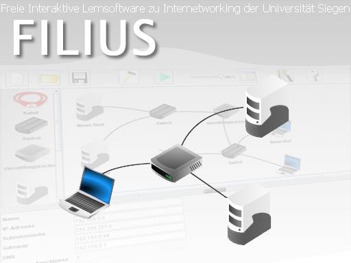[^1]

[^1]: All pictures are taken from the FILIUS program.

<!-- autogenerated table of contents, slightly modified -->

<!-- markdown-toc start - Don't edit this section. Run M-x markdown-toc-refresh-toc -->
**Table of Contents**

- [Introduction to the world of FILIUS](#introduction-to-the-world-of-filius)
    - [Preliminary Remark](#preliminary-remark)
    - [GUI of FILIUS](#gui-of-filius)
    - [The Design Mode](#the-design-mode)
        - [Network Components](#network-components)
            - [Server and Notebook](#server-and-notebook)
            - [Cable](#cable)
            - [Switch](#switch)
            - [Router](#router)
            - [Modem](#modem)
    - [The Simulation Mode](#the-simulation-mode)
        - [Network Applications in FILIUS](#network-applications-in-filius)
            - [System Applications](#system-applications)
            - [Client Applications](#client-applications)
            - [Server Applications](#server-applications)
    - [The Documentation Mode](#the-documentation-mode)
        - [Ways of Documentation](#ways-of-documentation)
    - [Exercises: Design and Simulate Networks](#exercises-design-and-simulate-networks)
        - [Direct Link](#direct-link)
        - [Connecting Computers Using a Switch](#connecting-computers-using-a-switch)
        - [Connecting Networks Using a Router](#connecting-networks-using-a-router)
        - [Simulation of the World Wide Web](#simulation-of-the-world-wide-web)
        - [E-Mail Services in the Network](#e-mail-services-in-the-network)
    - [Outlook](#outlook)
        - [Virtual and Physical Networks](#virtual-and-physical-networks)
        - [File Sharing in a _Peer-To-Peer_ Network](#file-sharing-in-a-peer-to-peer-network)
        - [Running a DHCP-Server](#running-a-dhcp-server)
        - [Creating and Implementing own Software](#creating-and-implementing-own-software)
        - [Static Routing](#static-routing)
- [Appendix A: IPv4-Addresses](#appendix-a-ipv4-addresses)

<!-- markdown-toc end -->


## Preliminary Remark
FILIUS[^2] was initially developed by the University of Siegen in
Germany, to provide a tool to enhance computer science lessons on
networks. The main target group are students of secondary schools but
with its wide range of applications it can be interesting for learners
of any age. The software especially promotes explorative learning and
is very helpful to teach students about the internet and its various
applications.

This document is intended to show the possible ways of using FILIUS in
the classroom. The different descriptions are always followed by
example exercises with corresponding solutions available for download
on the FILIUS website.

[^2]: FILIUS stands for **F**ree **I**nteractive **L**earning
Environment for **I**nternetworking of the **U**niversity of
**S**iegen.

## GUI of FILIUS
After the initial launch of the program you are prompted with the
option to choose the program language, which will be permanently
saved.[^4]

[^4]: This configuration preference can be found in the user directory
in the folder ```.filius```, which can be deleted for a reset.

From now on the program will appear in the following look:

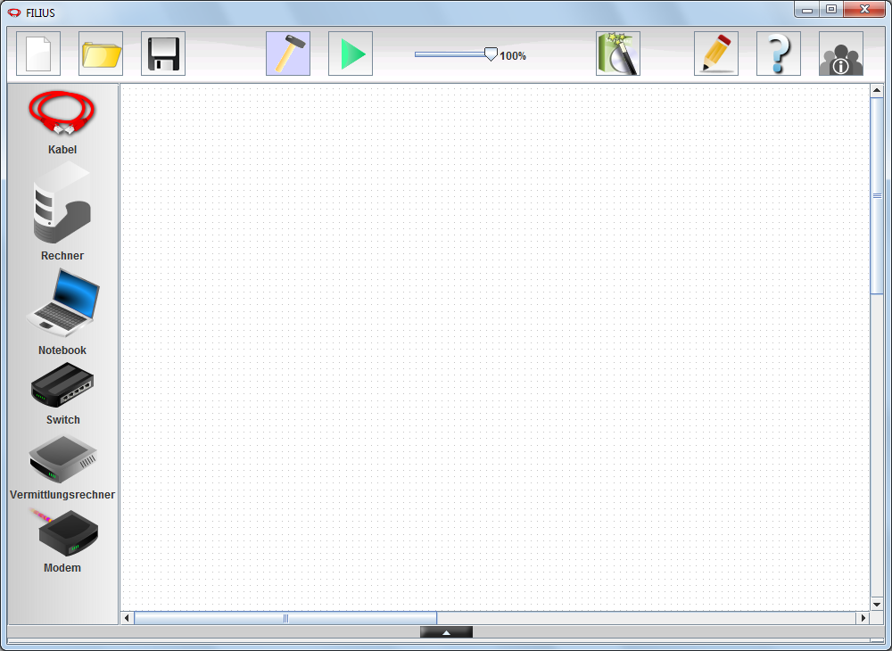{width=100%}

The program decides between three different modes of work, the design
mode, the simulation mode and the documentation mode:


To change to the design mode, simply click the hammer
{width=20px}
symbol in the toolbar on top. This mode is used to construct a network
or apply changes to it. After the start of the program, FILIUS will
always be in design mode.


To start the simulation mode, click the green arrow
{width=20px}
in the toolbar. This mode is used for testing the network you built,
installing different network applications on the computers and running these.


To switch to the documentation mode, select the pencil
{width=20px}
in the toolbar on top. This mode provides the option to add your own
annotations to the network and group certain parts of the network for
better understanding. Before starting to build the first network, we
want to explore these modi in more detail.

## The Design Mode
Before setting up your first network, this chapter will make you
familiar with the way the different components work in FILIUS. After
that, we will use the various components to build and test networks,
starting with some easy examples and increasing the complexity step by
step.

### Network Components
Filius provides a range of different components in the toolbar on the
left hand side. These can be positioned, connected, modified and
deleted in the workspace. To create a new component, use drag and drop
to move the component anywhere in the white workspace. To connect two
devices with a cable, select the cable in the toolbar and click on the
components you want to link. Connections remain even when components
are repositioned. Using a right click, you can delete any cable or
component again. Now, we will learn about the basic functions of the
different components and a deeper explanation will follow in the
chapter on designing and testing networks in FILIUS.

#### Server and Notebook
In the toolbar on the left hand side, FILIUS provides two different
types of computers to be used in our virtual networks. Both computers
are identical in the way they work and provide the same function but
it makes sense to keep a logical distinction between the two.


For a computer serving the task of a client, it is advised to use a
Notebook {width=20}, whereas for a
computer serving the task of a server, we will use a regular computer
{width=20}.


The components can be added by dragging them to the workspace, using
the left mouse button. The configuration of a computer can be seen by
using a double-click on the image or right click and select
configure. The picture displayed underneath will appear and provide
you the option to modify the name of the computer, its IP address, its
net mask and other settings. The standard configuration of a computer
is displayed in the following picture.


If you and your students are not familiar with the function of an IP
address or subnet mask, please read the appendix A for a short
description first.

#### Cable
Two computers can be connected using a cable
{width=20}. After selecting the cable from the
toolbar, you can first click on one and then the other component that
you want to connect in your workspace, to establish a link between the
two.

#### Switch
If you want to connect more than two computers with each other, you
need a central hub. The easiest way of doing so is using a switch
{width=20}. For a switch, the configuration
can also be modified by double-clicking on the icon. A switch
remembers all connected components after the first request is sent in
the network and redirects signals to their recipients. However, a
switch can only connect computers of a single network.

#### Router
To send a network signal from one network to another one we need a
router {width=20} to connect the two. In
order for the router to work properly, all connected components have
to lie in different networks. This also applies to single computers
that may be directly connected to it. After picking a router from the
side bar, FILIUS asks how many NICs (Network Internet Cards) it should
have, that means how many interfaces to networks it should
provide. This configuration can later be changed in the configuration
panel of the router, selecting the ```"Manage Connections"``` option.

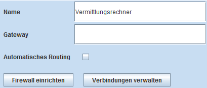

In the preferences panel you can also find a dedicated tab for each
interface with the configuration of the NIC and its network. Modify
the IP address according to the connected network, so that packages
can be routed correctly (often the first or last usable IP address of
the network). In addition, a gateway has to be added to every
computer in the network. The exact preferences will be explained in
detail in a later example.

#### Modem
FILIUS also provides the option to link several FILIUS-Programs
running on different computers in a physically existing network, such
as in a classroom. It is important to ensure that your firewall allows
such connections. To use this features, all FLIIUS-Programs need to
include a modem {width=20} in their virtual
network. The modem in one of the virtual networks needs to be set as
recipient, which can be done by ticking the box that says ```"Wait for
incoming connection request"```, and then then clicking the button
```"Activate"``` to start accepting incoming requests.


All modems of the other virtual networks can now establish a
physically existing network connection by using the real network IP of
the receiving modem. All modems will indicate a successful connection
with a small green dot.

## The Simulation Mode
Simulation mode is used to install software to the computers, remove
it or start it. To change to simulation mode click the green arrow in
the top hand toolbar {width=20}. FILIUS’ main
goal is to display network activity on the different layers of the OSI
model to the user and thereby enhance the understanding of the
functionality of networks.

To modify the speed in which the simulation will be displayed, use the
control panel on top {width=80}. This will
adjust the speed of the display of signals in cables as well as in the
OSI layers model, which can be seen by right clicking on any
computer.

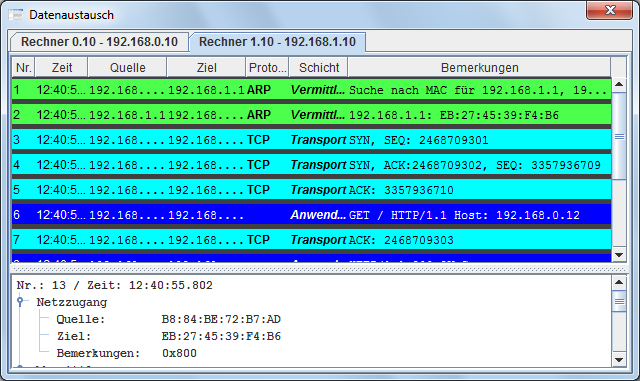

But before you will be able to see any network activity, it is
necessary to install software to the computers. Using a double click
or right click on a computer will provide you with the desktop the
selected device:


By clicking on the symbol for software installation
{width=20}, you can install
{width=20} and uninstall
{width=20} software on that computer. Following
is a brief description of the functions of the different pieces of
software.

### Network Applications in FILIUS
FILIUS has three different types of applications: client applications,
server applications and system applications. These will be briefly
explained according to their class.

#### System Applications


File Explorer: This applications enables you to copy actual existing
files from your computer’s hard drive on to a virtual computer in
FILUS.

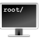

The command line let’s you manage the computer by using certain
commands that will be displayed on startup of the terminal.


Using the text editor, you can create simple text files, for example
HTML, and modify them. You can also modify files that you previously
imported using the file explorer.


The firewall can be used to open or close certain ports within the
network.


With this program you can open and view images.

#### Client Applications


This piece of software lets you virtually send and receive E-mails.


The web browser enables you to view websites. It can handle all
basic HTML.


The (network) client is used to connect to a server. It can be used to
test whether the network is properly connected.


Gnutella is a ```peer-to-peer``` application which allows you to share
files within a virtual network.

#### Server Applications


The DNS server is used to simulate the translation of symbolic host
names into their according IP Addresses.


Using an Email server, you can create different E-mail accounts
which can then be used by the E-mail program on a client computer.


This application transforms a computer into a web server, that enables
clients to view a website stored on the server, using the web
browser. The default website is defined by the file ```index.html```
in the virtual directory ```root/webserver```.


Once started, the echo server replies to all requests of clients by
sending back the received message.

## The Documentation Mode
FILIUS allows the user to document network structures and group them
symbolically. To start documentation mode click on the icon displaying
a pencil {width=20}.

### Ways of Documentation
FILIUS provides two different ways of documentation in this mode,
which will be briefly explained. From here on, the script will not
focus on using the documentation mode any more but it is up to the
user to meaningfully label or group their virtual networks.


Using text fields, the user can add information regarding the virtual
network. Text fields have no influence on the behaviour of the network
in design mode or on the network activity in simulation mode.


The same is true for structure fields. They can be used to
symbolically group single components of a network in a meaningful
way. The field can be dragged to the right size and will appear in the
background upon exiting the documentation mode.


By using the export button, your virtual network can be saved as a
portable network graphic (PNG file).

## Exercises: Design and Simulate Networks
In the following chapter, we will design and test different networks,
starting with easy examples and rising in complexity. Therefore, a
constant switching between design and simulation mode is
necessary. The symbol on the left of each exercise indicates whether
it is to be done in design {width=20} or simulation
{width=20} mode.

### Direct Link
The simplest way of connecting to computers is through a direct link
using only a network cable. This is called a ```peer-to-peer```
connection. With this type of connection, computers can be connected
using a crossover cable to enable the transfer of data between the
two.

> #### Exercise 1
> {width=20} Create a simple network with two
> linked computers, serving as clients.
>
> 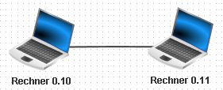
>
> Configure the computers with the names and the IP addresses
> ```192.168.0.10/24``` and ```192.168.0.11/24```.
> > Note: If you don’t want to manually name each computers, use the
> > option ```“Use IP address as Name”``` to let FILIUS automatically
> > set the computer’s name as its IP address.

> #### Exercise 2a
> {width=20} Select the computer with IP
> address ending with ```0.10``` and install the command line on
> it. Start the command line and test the connection to computer
> ```0.11``` using the command ```ping 192.168.0.11```. Inspect the
> network activity by displaying the exchanged data of computer
> ```0.10``` in the ISI/OSI model.
>
> 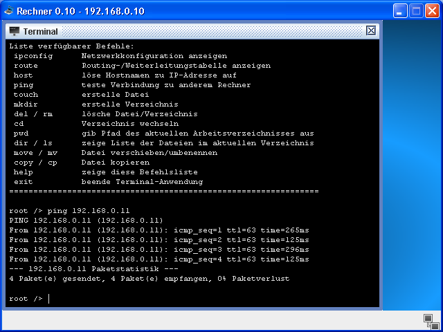
>
> The command line shows that the computer sends four ICMP requests
> (```ping```) to the other computer and each time, waits for a
> response (```pong```). This data exchange can also be displayed in
> the data exchange window. Here, the first two lines belong to the
> address resolution protocol, which is used to find out the physical
> address of the other computer. The following eight lines stand for
> the exchange of the ```ping```-```pong``` packets, where always two
> lines form a pair. They belong to the _Internet Control Message
> Protocol (ICMPv4)_, which is part of the internet protocol IPv4.
>
> 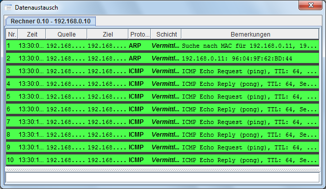
>
> We can also observe that the network activity reaches only to the
> internet layer. The higher and more complex layers of the OSI model
> are not yet needed. By selecting one of the lines in the data
> exchange window, it is possible to view information on the lower
> layers of the OSI model as well as more detailed information on the
> layers in use.

> #### Exercise 2b
> {width=20} Also try out other commands using
> the command line, such as ```ipconfig```, ```host localhost``` or
> ```dir```. The use of the ```host``` command will become clear in a
> later example including a DNS Server.

### Connecting Computers Using a Switch
If you want to connect more than two computers to a network in FILIUS,
it is necessary to use a switch, to which any desired number of
computers can be connected. After the first use in simulation mode, a
switch remembers the MAC addresses according to the IP addresses of
all computers so that it can forward data packages faster. We will now
use this component to connect three computers with one another.

> #### Exercise 3
> {width=20} Now, expand your network with a third
> computers, a server, with the name displayed below and the IP
> address ```192.168.0.12/24```. Remember to use the symbol
> {width=20} for the purpose of a server. Then
> connect all three computers using a switch as shown in the picture:
>
> 

> #### Exercise 4
> {width=20} Next, open the desktop of server
> ```0.12```, install an ```Echo Server``` to it and start it on the
> preset port ```55555```. Use one of the notebooks to install a
> ```Generic Client``` and connect it to the server. Try sending some
> text messages from the client to the server and observe the
> outcome. Also take a look at the network activity in the data
> exchange window of the notebook.
>
> {width=49%}
> {width=49%}
>
> {width=62%}
> {width=37%}
>
> The data exchange window shows that in this example, the transport
> layer is needed for the first time. Establishing the connection
> between client and server already uses three layers in the ISO/OSI
> model. The first two lines are again used to connect the server's IP
> address to the corresponding MAC address (_Address
> Resolution Protocol, ARP_).
>
> As soon as you send a message from client to server, the fourth
> layer, called application layer, comes into play. The application,
> which is the ```Generic Client```, first of all uses the application
> layer, then the transport layer, the internet layer and finally the
> network layer. All this information will be displayed upon clicking
> on the first dark blue line in the data exchange model, which will
> display the image on the right.

In the following exercises, keep in mind to have a look at the data
exchange window from time to time to get an idea what kind of
information is being transmitted within the network. You will for
example notice the huge amount of data that has to be transmitted
while sending E-mails.

### Connecting Networks Using a Router
Before installing and testing more software on the computers, we want
to expand our existing network with three more computers.

> #### Exercise 5
> {width=20} Create a second network with three new
> computers as displayed below. We want the three new computers to be
> in a logically different network for which we will use the IP
> addresses from ```192.168.1.10/24``` up to
> ```192.168.1.12/24```. Finally, connect the two networks using a
> router and configure the two network interface cards with the IP
> addresses ```192.168.0.1/24``` and ```192.168.1.1/24```.
>
> 
>
> {width=20} Finally, test the connection
> between computers ```0.10``` and ```1.10``` using the ```ping```
> command.
>
> If you did everything as described above, FILIUS will display the
> following message in the command prompt:
>
> 

The reason for this response is, that the message would have to leave
the local network. However, we haven’t yet configured a gateway for
the different computers, which would determine where messages that
have to leave the network are forwarded to.

> #### Exercise 6
> {width=20} The router has a network interface
> card with the address ```192.168.0.1``` which you will configure as
> a gateway for the three computers on the left hand side. Set the
> gateway for the three notebooks on the right hand side to
> ```192.168.1.1``` accordingly.
>
> 
>
> {width=20} Now try the same connection again
> and it should work properly.

When taking a look at the data exchange window, you can observe that
the first request takes a lot longer then the following three. This is
because the routing table of the two switches is empty at the
beginning and is then created after the first request.

> #### Exercise 7
> {width=20} Now try and test your network with
> a ```Generic Client``` and an ```Echo Server```. Use Notebook
> ```1.10``` to install a ```Generic Client``` and connect it to
> server ```0.12```.

### Simulation of the World Wide Web
The most important task of the internet today is surely the world wide
web. Using FILIUS, you can simulate and analyze the basic processes
involved in the communication between a web browser and a remote web
server. The network we have created in exercise 6 is sufficient for
this task. We will use server ```0.12``` as our web server and
notebook ```1.10``` as our client and web browser. But let’s first set
up the web server.

> #### Exercise 8
> {width=20} Use Server ```0.12``` to install a
> web server and a text editor. Take the text editor to open the file
> ```index.html``` which can be found in the virtual directory
> ```root/webserver```. Now you can modify the ```html```-file in
> order to show the information you like. Also create a new page with
> the name ```contact.html``` which you will link to from the first
> side.
>
> 

> #### Exercise 9
> {width=20} On the desktop of your web server,
> start the application "webserver" using a double click. Then start
> the virtual web server clicking the button Start (left
> picture). After that, switch to notebook ```1.10``` to install a web
> browser. Start the browser and try to establish a connection to the
> web server by typing the URL ```http://192.168.0.12``` into the
> address field of your web browser (right picture).
>
> 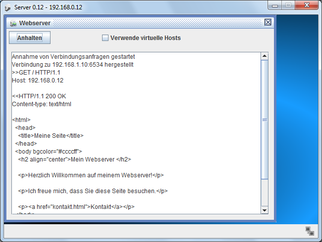{width=49%}
> {width=49%}

We established a connection but this is not the way we usually
communicate with other web servers. Normally, we contact a website by
typing the URL containing the hostname and not the IP address of the
web server. The resolution of hostname and the corresponding IP
address is done by a _domain name system_ server, also called DNS
server, which we will now configure.

> #### Exercise 10
> {width=20} Create a new server with the IP
> address ```192.168.2.10/24``` and the gateway set to
> ```192.168.2.1```. Change the number of interfaces of your router to
> three by navigating to the ```"General"``` tab of its configuration
> and select the button ```"Manage Connections"```. Now move to the
> tab of the new network interface card and set the IP address to
> ```192.168.2.1``` and the subnet mask to
> ```255.255.255.0```. Finally connect the new server to the router
> with a cable.
>
> 
>
> To enable all computers to use the service of the DNS server, we
> need to add the IP address of the DNS server to the configuration of
> every Notebook.

> #### Exercise 11
> {width=20} Add the IP address of the DNS server
> ```192.168.2.10``` to the configuration of every Notebook.
>
> 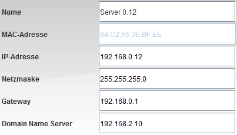
>
> Lastly, we need to give our web server a suitable URL and add it to
> the DNS server’s reference table so that we can reach it through its
> name.

> #### Exercise 12a
> {width=20} Select server ```2.10```, install
> the application ```DNS server``` and start it with a double
> click. As domain name type in ```www.filius.com``` and below the IP
> address ```192.168.0.12```, belonging to our server. Then click the
> Add button to add the entry to the DNS server’s reference
> table. Finally start the DNS server by clicking the ```"Start"```
> button (left picture) and test the connection by using your web
> browser on a notebook and searching for the URL
> ```http://www.filius.com``` (right picture).
>
> {width=49%}
> {width=49%}
>
> If the web browser returns the message ```"Server does not
> exist!"```, the reason is most likely that you haven’t yet started
> the DNS server or you asked for a URL that you haven’t yet added to
> the reference table of your DNS server.

> #### Exercise 12b
> {width=20} At the beginning of our tutorial,
> we learned about the ```host``` command in the terminal. Now try
> again to use the ```host``` command with the URL
> ```www.filius.com```. Now you will see that the DNS server does its
> job and returns the IP of the web server.
>
> 

### E-Mail Services in the Network
FILIUS provides the feature of simulating the work of different Email
servers and the way they interact. At first, we will configure a
single E-mail server and use a Notebook with an E-mail Program
installed to use the Email service. Later we will install several
E-mail servers that are linked to each other.

> #### Exercise 13
> {width=20} Select Server ```0.12``` to
> install the application “Email server” and start it by using a
> double click. Create a new account with username ```bob``` and
> password ```bob``` (left image). See how your new account appears in
> the account list. Then start the server using the start button.
>
> {width=49%}
> {width=49%}

Next, we need to set up our DNS server to make it accept the new mail
domain.

> #### Exercise 14
> {width=20} Start the application "DNS server"
> on server ```2.10```. Add a new mail exchange with the mail domain
> ```filius.com``` and the mail server domain name
> ```www.filius.com```. Then restart the server.
>
> 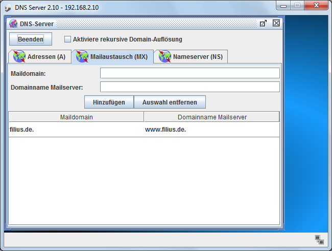

Finally we need to install the Email program to one of our notebooks
and configure it.

> #### Exercise 15
> {width=20} Select notebook ```0.10``` to
> install the new application ```"E-mail program"``` and launch
> it. Click on the button ```"Account"``` to create a new account and
> configure it with the following information of your E-mail server
> (left picture):
>
> Name: ```bob```
>
> E-Mail-Address: ```bob@filius.de```
>
> POP3-Server: ```www.filius.de```
>
> POP3-Port: ```110```
>
> SMTP-Server: ```www.filius.de```
>
> SMTP-Port: ```25```
>
> Username: ```bob```
>
> Password: ```bob```
>
> After that, send an E-mail to ```bob@filius.com``` (that means to
> yourself) and then retrieve your mails (right picture).
>
> 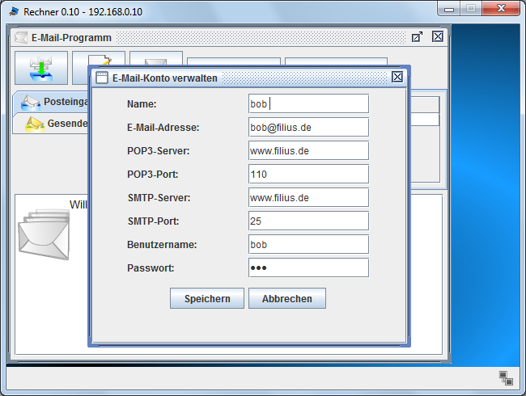{width=49%}
> 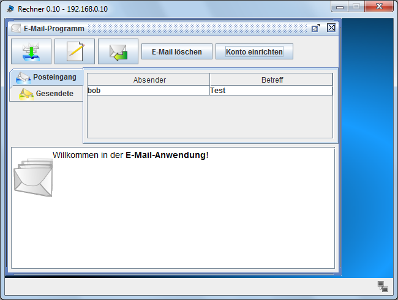{width=49%}

> #### Exercise 16
> {width=20} Next, add another E-mail address
> to the E-mail server with the name ```bert@filius.com```. Also set
> up an E-mail program on notebook ```0.11``` so that ```bob``` and
> ```bert``` can send E-mails to each other.

Lastly, we will set up a second E-mail server, which we want to add to
the right side of our network (```192.168.1.0```).

> #### Exercise 17
> {width=20} Add another server with the name
> server ```1.13``` to the right side of your network and install a
> mail server with the mail domain ```filia.com```. Finally add an
> account with the name ```alice@filia.com``` to the server.
>
> 
>
> Also extend the mail exchange table of your DNS server, so that the
> new mail domain will be excepted.
>
> Take notebook ```1.10``` to install an E-mail program and configure
> it for the account ```alice@filia.com```.
>
> Lastly, try sending E-mail between the two
> accounts ```bob@filius.com``` and ```alice@filia.com```.

## Outlook
If you followed the tutorial up to here, you have mastered all the
basic functions of FILIUS. From here on, I will give a little prospect
of further possibilities of FILIUS. In how far these can be integrated
into your teaching plans depends on the strength of your students and
the configuration of your classroom network.

### Virtual and Physical Networks
In the chapter on the components of FILIUS we already talked about the
modem as providing the possibility to leave the virtual network and
send signals over a physically existing network. A premise for this
is, of course, a physically existing network of at least two computers
running FILIUS, and a local firewall that is configured not to block
FILIUS’ signals.

You can get an impression of this setup through the following example,
where only one notebook is able to communicate with the physically
existing network via a modem.


> #### Exercise 18
> {width=20} Create the network structure displayed
> below on two (physically) different computers (let’s call them
> Computer A and Computer B) with different computer IPs that are part
> of a physical network. On computer A, set the modem to accept
> incoming requests, ticking the box ```"Wait for incoming connection
> request"```, and click the button ```"Activate"```. On Computer B,
> configure the modem so that it connects to Computer A. For this
> purpose, insert the physical IP address of Computer A in the field
> named IP address and press the button ```"Connect"```. (If you want
> to try this on one computer, simply write ```localhost``` into the
> IP address field and choose any port.) Both modems will show a green
> light if connected successfully.
>
> 

If connecting the two modems worked, you can now set up the two
virtual notebooks for network communication. You can for example
install an ```Echo Server``` on the virtual notebook on Computer A and
a ```Generic Client``` on the virtual notebook on Computer B. After
starting the ```Echo Server```, the virtual notebook on Computer B
should be able to communicate with it over the physical network.

> #### Exercise 19
> {width=20} Install an ```Echo Server``` and a
> ```Generic Client``` to the virtual notebooks on Computers A and
> B. Then start the ```Echo Server``` and connect and test the ```Generic
> Client```. Now you can also test other applications on the virtual
> computers. Also have a look at the data exchange between the both.

### File Sharing in a _Peer-To-Peer_ Network
FILIUS offers the option to connect several computers to a
peer-to-peer network and share files throughout the network using the
application Gnutella.

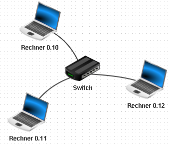

 All computers in such kind of network serve the function of a client
 and can connect to all other computers of the network, which is why
 we use a notebook for this exercise.

> #### Exercise 20
> {width=20} Create the network as displayed above,
> connecting three laptops using a switch to a peer-to-peer network.
>
> {width=20} Then, install the application
> "Gnutella" to all three computers and additionally a "File explorer"
> to Notebook ```0.10```. Start the file explorer and copy the file
> ```index.html``` from the directory ```webserver``` to the directory
> ```peer2peer```, using a right click.
>
> Next, launch the application “Gnutella” on Notebook ```0.12``` and
> join the network of notebook ```0.10``` (IP address
> ```192.168.0.10/24```). The list of connected neighbours should
> refresh automatically (left picture).
>
> Now you can search the peer-to-peer network for files named
> ```index.html``` and download them (right picture).
>
> {width=49%}
> 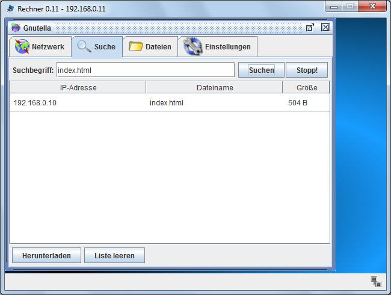{width=49%}

### Running a DHCP-Server
Especially in large networks it is practical to set up a DHCP server
which takes over the function of assigning IP addresses to the
computers automatically. FILIUS provides the possibility to simulate
just that. In the following exercise we will implement a DHCP server
to our network of the previous exercise.

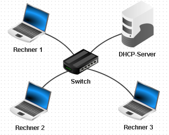

> #### Exercise 21a
> {width=20} Implement a DHCP server into your
> existing network and rename all notebooks in order to suggest that
> the IP address assignment now works automatically. Configure the new
> server with the IP address ```10.0.0.10/24``` and then set it up as
> a DHCP server by clicking the button as shown in the picture below.
>
> 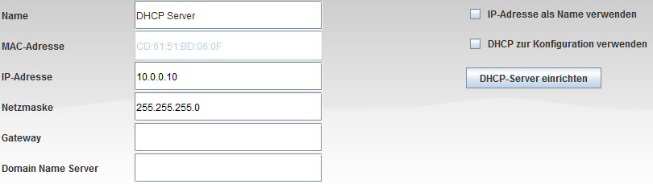
>
> Now, a dialogue box will pop up that asks you to enter the DHCP
> server settings. Select the IP address range from ```10.0.0.100```
> to ```10.0.0.200``` and activate DHCP by ticking the box ```"Active
> DHCP"```.
>
> 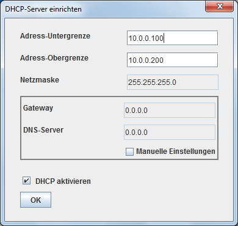

> #### Exercise 21b
> {width=20} Next, for each computer, tick the box
> ```"Use DHCP for configuration"``` to use the DHCP server for IP
> address assignment. You will notice that you will not be able to
> manually change the configurations anymore.
>
> {width=20} As soon as you switch to
> simulation mode, the clients will be assigned an IP address by the
> DHCP server. All wires will blink for a short time to set up the new
> configurations. (If this does not happen, FILIUS might still have
> old settings stored to the switch and you will have to restart the
> application.)
>
> Now start each computer and install the teminal. Then test which IP
> address the computers have been assigned by the DHCP server by using
> the ```ipconfig``` command.

### Creating and Implementing own Software
FILIUS even provides the option to create your own software and
install it to the virtual computers.


With the magic wand symbol {width=20} you can
reach a 3 step assistant which enables you to integrate your own
software, for example a chat server and client application. FILIUS
provides some code outlines in Java in the second step.

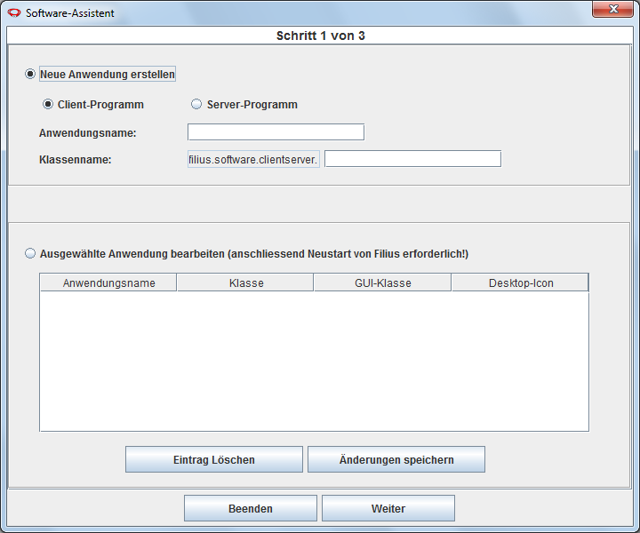

### Static Routing
In the chapter on connecting two networks using a router we restricted
the traffic to flow through only one router. In reality, things look a
little bit different, because the internet is a vast web of
uncountable switches and numerous possible ways for a data package to
go. It can never be determine which way it will take. Let’s have a
look at the following, still simple, example:


> #### Exercise 22a
> {width=20} Create the network displayed
> above. Configure router I so that it is connected to Router II in
> network ```2.0.0.0/24``` and to Router III in network
> ```3.0.0.0/24```. Configure Router I with the first addresses of
> each network.
>
> Then, configure Router II to be connected to Route III in network
> ```1.0.0.0/24``` and with the second IP address of each network.
> Finally, configure Router III with the third IP address of each
> network.

All together the new network will look like this:


Now we are still missing the settings for packet forwarding. First of
all, configure the gateways for the computers of the different
networks:

> #### Exercise 22b
> {width=20} Set the gateway of Notebook ```0.10```
> in Lan A to ```192.168.0.1```, so that Router I will be used as its
> gateway. Then, set the gateway of Notebook ```1.10``` from Lan B to
> ```192.168.1.1``` and the gateway of notebook ```2.10``` from Lan C
> to ```192.168.2.1``` accordingly.

FILIUS routers are able to run routing automatically. For using this
option simply tick the box ```"Automatic Routing"``` in the
configuration of each router and the routing information protocol
(RIP) will do the job of finding the shortest way within the network.

For a better understanding of how routing actually works, it is still
possible to manually configure the routing in FILIUS. Every router has
its own forwarding table which describes how incoming data packets are
to be forwarded. The following three tables are the result of the
network shown above:

##### Router I
<!--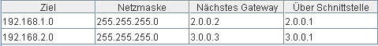-->
 Ziel                  Netzmaske        Next Hop             Interface
-------------- ------------------- ------------------- -------------------
192.168.1.0         255.255.255.0       2.0.0.2              2.0.0.1
192.168.2.0         255.255.255.0       3.0.0.3              3.0.0.1
-------------- ------------------- ------------------- -------------------

##### Router II
<!--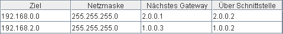-->
 Ziel                  Netzmaske        Next Hop             Interface
-------------- ------------------- ------------------- -------------------
192.168.0.0         255.255.255.0       2.0.0.1              2.0.0.2
192.168.2.0         255.255.255.0       1.0.0.3              3.0.0.2
-------------- ------------------- ------------------- -------------------

##### Router III
<!--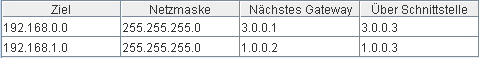-->
 Ziel                  Netzmaske        Next Hop             Interface
-------------- ------------------- ------------------- -------------------
192.168.0.0         255.255.255.0       3.0.0.1              3.0.0.3
192.168.1.0         255.255.255.0       1.0.0.2              1.0.0.3
-------------- ------------------- ------------------- -------------------

> #### Exercise 22c
> {width=20} Configure the forwarding tables of the
> three routers according to the representations given above. Unselect
> the box saying ```"Show all entries"``` for a clearer view.
>
> {width=20} Install an ```Echo Server``` to
> Server ```2.10``` and a ```Generic Client``` to laptop
> ```0.10```. Connect server and client and see how the packages are
> forwarded. It is easier to observe when you lower the speed down to
> about 50%.
>
> {width=20} Now modify the forwarding table so
> that messages sent from LAN A to LAN B are rerouted to run through
> LAN C as well. Observe the network activity.

# Appendix A: IPv4-Addresses
IPv4 addresses are comprised of 32 Bits, split into 4 blocks of 8 Bit
each. This gives a total range of IP addresses from ```0.0.0.0``` to
```255.255.255.255```. For a better understanding of the process of
routing it is helpful to translate the numbers from decimal system to
binary system.

> #### Exercise A1
> Practice the translation between binary and decimal
> system. Translate your result back to the other system to check
> yourself.
>
> a. ) ```  1101 1110₂```
> a. ) ```  0011 1111₂```
> a. ) ```  1111 1101₂```
> a. ) ```  0101 1010₂```
> a. ) ```  96₁₀```
> a. ) ```  254₁₀```
> a. ) ```  17₁₀```
> a. ) ```  127₁₀```

A subnet mask in IPv4 is another 32 bit number that splits the IP
address into a network prefix and the host identifier. Through AND
operations between IP address and subnet mask, the network prefix can
be extracted. Through AND operations between IP address and the
inverted subnet mask, the host identifier will show.

The smallest address of the network is used to reference the network
itself and the highest IP is reserved for broadcasting.

> #### Example:
> IP Address: ```192.145.96.201 = 11000000.10010001.01100000.11001001```
>
> Subnet Mask: ```255.255.255.240 = 11111111.11111111.11111111.11110000```
>
> _AND_-Operation reveals the network prefix: ```192.145.96.192 = 11000000.10010001.01100000.11000000```
>
> _AND_-Operation with the inverted subnet mask reveals the host identifier:
> ```0.0.0.9 = 00000000.00000000.00000000.00001001```
>
> The highest IP address is reserved for broadcasting (all host bits ```= 1```).
>
> Broadcast: ```192.145.96.207 = 11000000.10010001.01100000.11001111```
>
> Available range of addresses within the network:
> ```192.145.96.193 = 11000000.10010001.01100000.11000001```
> up to ```192.145.96.206 = 11000000.10010001.01100000.11001110```
>
> Often, the first or the last usable IP address is used as the
> default gateway, here: ```192.145.96.193``` or ```192.145.96.206```.
>
> The network prefix is also used as the network address (all host
> bits ```= 0```).

> #### Exercise A2
> Complete the following table.
>
> -------------------------------------------------------------------------------------------------
> IP Address        Subnet Mask      Net-ID        Host         First       Broadcast    Number
>                                              Identifier      usable      Address      of usable
>                                                              Address                  Addresses
> --------------- ---------------- -------- ----------------- ----------- ------------ ------------
> 192.168.213.15  255.255.255.192
>
> 172.16.5.254    255.255.255.0
>
> 172.254.13.8    255.255.248.0
>
> 10.38.133.5     255.255.0.0
>
> 10.0.0.15       255.0.0.0
> -------------------------------------------------------------------------------------------------

> #### Exercise A3
> A message is sent from a computer holding the IP address
> ```192.168.203.15``` in the network with the subnet mask
> ```255.255.248.0```. The target is a computer with the IP address
> ```192.168.200.65```. Does the message remain within the network
> segment or is routing necessary?
